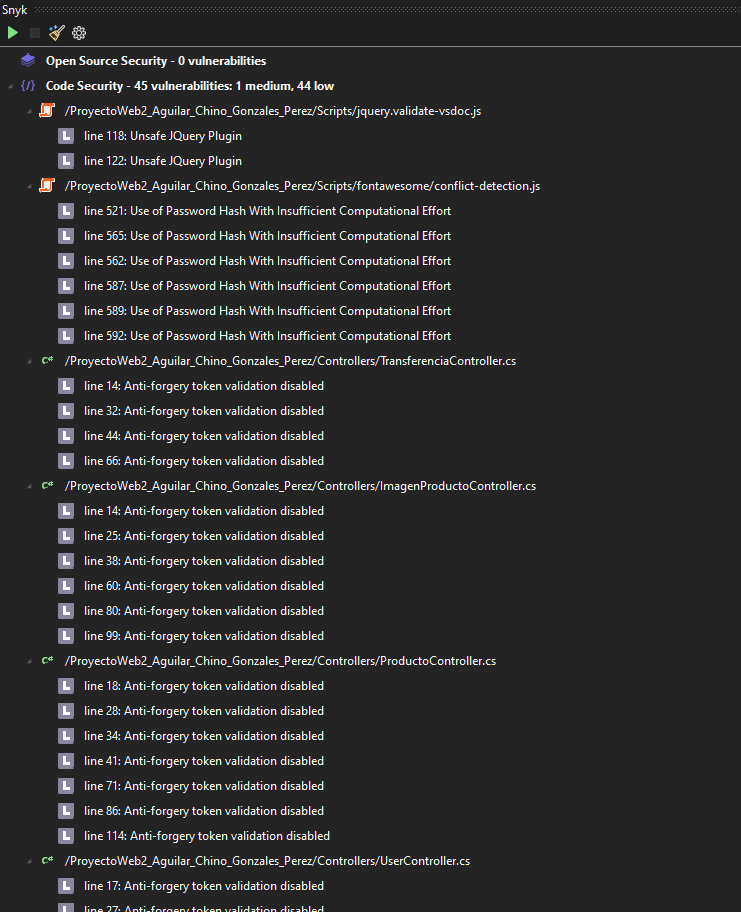
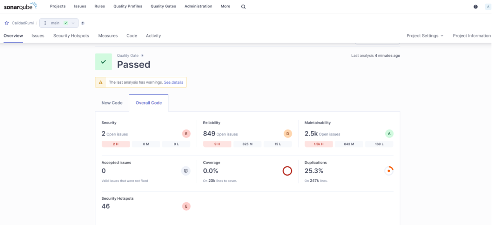

[comment]: 

**UNIVERSIDAD PRIVADA DE TACNA**

**FACULTAD DE INGENIERIA**

**Escuela Profesional de Ingeniería de Sistemas**

**Proyecto *RUMI***

Curso: *Calidad y Pruebas de Software*

Docente: *Ing. Patrick Jose CUADROS QUIROGA*

Integrantes:

***CAXI CALANI Luis Eduardo (2018062487)***
***AGUILAR PINTO Victor Eleazar (2018062487)***
***CHATA CHOQUE Brant Antony (2018062487)***

**Tacna – Perú**

***2024***

**  
**

\pagebreak

Sistema Web de Recompensas por Participaciones para Jovenes

Informe de Factibilidad

Versión *1.0*

|CONTROL DE VERSIONES||||||
| :-: | :- | :- | :- | :- | :- |
|Versión|Hecha por|Revisada por|Aprobada por|Fecha|Motivo|
|1\.0|MPV|ELV|ARV|21/09/2024|Versión Inicial|

\pagebreak

# **INDICE GENERAL**

Resumen

Abstract

[1. Antecedentes o introducción](#_Toc52661346)

[2. Titulo](#_Toc52661347)

[3. Autores](#_Toc52661348)

[4. Planteamiento del problema](#_Toc52661349)

[4.1 Problema](#_Toc52661350)

[4.2 Justificación](#_Toc52661351)

[4.3 Alcance](#_Toc52661352)

[5. Objetivos](#_Toc52661356)

[5.1 General](#_Toc52661350)

[5.2 Especificos](#_Toc52661351)

[6. Referentes teóricos](#_Toc52661357)

[7. Desarrollo de la propuesta](#_Toc52661356)

[7.1 Tecnología de información ](#_Toc52661350)

[7.2 Metodología, técnicas usadas](#_Toc52661351)

[7. Cronograma](#_Toc52661356)

\pagebreak

**<u>Tema: Mejoramiento de la Aplicación RUMI</u>**

1. **Antecedentes o introducción**
    
La auditoría de la aplicación RUMI se ha realizado con el objetivo de identificar vulnerabilidades de seguridad y problemas de calidad de código. Para ello, se utilizaron herramientas de análisis como Snyk y SonarQube, que permitieron detectar fallos críticos y mejorar la seguridad de la aplicación.

2. **Titulo**
    
<b>Auditoría y Mejoramiento de la Seguridad en la Aplicación RUMI usando Snyk y SonarQube</b>

3. **Autores**

4. **Planteamiento del problema**

    4.1. Problema
    
La aplicación RUMI presenta vulnerabilidades que comprometen la seguridad de los usuarios y el rendimiento del sistema. Estas incluyen la falta de validación de tokens anti-forgery, el uso de algoritmos de hash débiles, y versiones obsoletas de bibliotecas externas.

    4.2. Justificación
    
La seguridad de las aplicaciones es un factor clave para garantizar la protección de los datos de los usuarios y la estabilidad del sistema. Esta auditoría es esencial para reducir riesgos y asegurar el cumplimiento de los estándares de seguridad en la aplicación RUMI.

    4.3. 

5. **Objetivos**

    5.1. General
    
Mejorar la seguridad y la calidad de código de la aplicación RUMI mediante el análisis de vulnerabilidades y la implementación de mejoras recomendadas por las herramientas de análisis Snyk y SonarQube.

    5.8. Especifico
    <ul>
        <li>Detectar y corregir vulnerabilidades en el código y dependencias con Snyk.</li>
        <li>Mejorar la calidad del código mediante el análisis estático de SonarQube.</li>
        <li>Implementar medidas para reducir la deuda técnica de la aplicación.</li>
    </ul>

6. **Referentes teóricos**
    Diagramas de Casos de Uso, Diagrama de Clases, Diagrama de Componentes y Arquitectura.

7. Desarrollo de la propuesta
    
El análisis de la aplicación RUMI fue llevado a cabo utilizando las herramientas Snyk y SonarQube, las cuales detectaron varias áreas de mejora, tanto en la seguridad como en la calidad del código.

    7.1.   Tecnología de información 
    
<b>Snyk:</b> Esta herramienta se utilizó para identificar vulnerabilidades en las dependencias de código abierto y en el código fuente de la aplicación. Se encontraron problemas como el uso de hash débil (MD5) y dependencias obsoletas.

    

    
<b>SonarQube:</b> Herramienta de análisis estático utilizada para evaluar la calidad del código. Detectó problemas de duplicación de código y alta complejidad ciclomática en algunos módulos clave.

    

    7.2.   Metodología, técnicas usadas
    
El análisis se realizó en varias fases:

    <ul>
        <li><b>Fase 1:</b> Análisis inicial con Snyk para identificar vulnerabilidades de seguridad en las dependencias y el código.</li>
        <li><b>Fase 2:</b> Análisis estático con SonarQube para detectar problemas de calidad, como código duplicado y alta complejidad.</li>
        <li><b>Fase 3:</b> Implementación de mejoras y reanálisis de la aplicación para verificar que los problemas se resolvieran.</li>
    </ul>

8. Cronograma
    
<b>Personas involucradas:</b> Equipo de desarrollo, equipo de seguridad.

    
<b>Tiempo:</b> Se estima que la corrección de todas las vulnerabilidades identificadas, así como la implementación de mejoras en la calidad del código, se completará en un periodo de 4 semanas.

    
<b>Recursos:</b> Las herramientas utilizadas incluyen Snyk, SonarQube y Visual Studio. Los desarrolladores deberán seguir las recomendaciones del análisis para realizar los cambios pertinentes.

